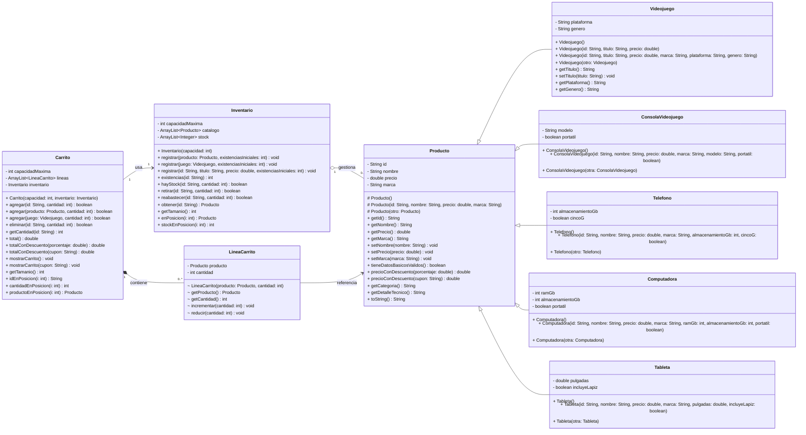

# Proyecto - Unidad III - Practica: Tienda de Tecnologia y Videojuegos (Herencia)

Competencia: aplicar encapsulamiento, constructores, sobrecarga, herencia y polimorfismo para resolver un problema de tienda.

## Objetivo
Implementar un sistema orientado a objetos con productos heterogeneos, inventario y carrito de compras:

- Producto (clase base)
- Subclases de producto (Videojuego, ConsolaVideojuego, Telefono, Computadora y Tableta)
- Inventario (catalogo + existencias)
- Carrito (operaciones de compra, devolucion y totalizacion)

## Version plantilla para autograding

Esta version del proyecto incluye metodos con logica incompleta marcados con `TODO(autograding)`.

- Objetivo didactico: que el estudiante implemente validaciones, busquedas y calculos respetando herencia/polimorfismo.
- Los `TODO` ya tienen pistas cortas para orientar la solucion sin darla completa.
- El proyecto compila, pero varias pruebas fallaran hasta completar la logica.

Archivos con vaciado intencional de logica:

- `logica/Producto.java`
- `logica/Inventario.java`
- `logica/Carrito.java`

## Requisitos funcionales

### 1) Jerarquia de productos

- Clase base `Producto` (no abstracta) con atributos base: `id`, `nombre`, `precio`, `marca`.
- Validaciones base: texto no vacio y precio no negativo.
- Metodos comunes:
  - `precioConDescuento(double porcentaje)` con rango valido [0,100].
  - `precioConDescuento(String cupon)` con cupones `REGALO10`, `GAMER10`, `TECH20`, `GAMER20`.
    - `getCategoria()` y `getDetalleTecnico()` con implementacion base, sobrescribibles en subclases.
- Subclases implementadas:
  - `Videojuego`
  - `ConsolaVideojuego`
  - `Telefono`
  - `Computadora`
  - `Tableta`

### 2) Clase Inventario

- Mantiene productos y stock usando `ArrayList`.
- El constructor define capacidad maxima de productos distintos.
- Metodos clave:
  - `registrar(Producto producto, int existenciasIniciales)`
  - `registrar(Videojuego juego, int existenciasIniciales)`
  - `registrar(String id, String titulo, double precio, int existenciasIniciales)`
  - `existencias(String id)`
  - `hayStock(String id, int cantidad)`
  - `retirar(String id, int cantidad)`
  - `reabastecer(String id, int cantidad)`
  - `obtener(String id)`

### 3) Clase Carrito

- Mantiene asociacion 1:1 con `Inventario`.
- Usa `ArrayList` para las lineas internas del carrito.
- El constructor define capacidad maxima de lineas distintas en el carrito.
- Metodos clave:
  - `agregar(String id, int cantidad)`
  - `agregar(Producto producto, int cantidad)`
  - `agregar(Videojuego juego, int cantidad)`
  - `eliminar(String id, int cantidad)`
  - `getCantidad(String id)`
  - `total()`
  - `totalConDescuento(double porcentaje)`
  - `totalConDescuento(String cupon)`

## Nota sobre ArrayList y capacidad maxima

`ArrayList` es dinamica, pero en este proyecto la capacidad maxima es una regla de negocio.

- `new ArrayList<>(n)` solo establece capacidad inicial interna (optimiza realocaciones).
- El limite real se aplica validando `size() >= capacidadMaxima` antes de insertar.
- En el carrito, ese limite controla cuantas lineas distintas se permiten en una compra.

## Diagrama de clases
[Editor en linea](https://mermaid.live/)


[Referencia-Mermaid](https://mermaid.js.org/syntax/classDiagram.html)

## Diagrama de clases UML con draw.io
El repositorio está configurado para crear Diagramas de clases UML con ```draw.io```. Para usarlo simplemente agrega un archivo con extensión ```.drawio.png```, das doble clic sobre el mismo y se activará el editor ```draw.io``` incrustado en ```VSCode``` para edición. Asegúrate de agregar las formas UML en el menú de formas del lado izquierdo (opción ```+Más formas```).

## Uso del proyecto con make

### Default - Compilar+Probar+Ejecutar
```
make
```
### Compilar
```
make compile
```
### Probar todo
```
make test
```
### Ejecutar App
```
make run
```
### Limpiar binarios
```
make clean
```
## Comandos Git-Cambios y envío a Autograding

### Por cada cambio importante que haga, actualice su historia usando los comandos:
```
git add .
git commit -m "Descripción del cambio"
```
### Envíe sus actualizaciones a GitHub para Autograding con el comando:
```
git push origin main
```
## Comandos individuales
### Compilar

```
find ./ -type f -name "*.java" > compfiles.txt
javac -d build -cp lib/junit-platform-console-standalone-1.5.2.jar @compfiles.txt
```
Ejecutar ambos comandos en 1 sólo paso:

```
find ./ -type f -name "*.java" > compfiles.txt ; javac -d build -cp lib/junit-platform-console-standalone-1.5.2.jar @compfiles.txt
```


### Ejecutar Todas la pruebas locales de 1 Test Case

```
java -jar lib/junit-platform-console-standalone-1.5.2.jar -class-path build --select-class miTest.AppTest
```
### Ejecutar 1 prueba local de 1 Test Case

```
java -jar lib/junit-platform-console-standalone-1.5.2.jar -class-path build --select-method miTest.AppTest#appHasAGreeting
```
### Ejecutar App
```
java -cp build miPrincipal.Principal
```
Los comandos anteriores están considerados para un ambiente Linux. [Referencia.](https://www.baeldung.com/junit-run-from-command-line)
